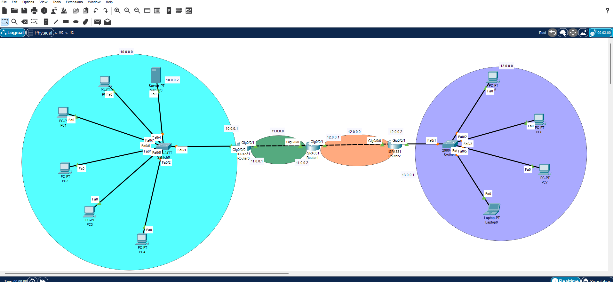
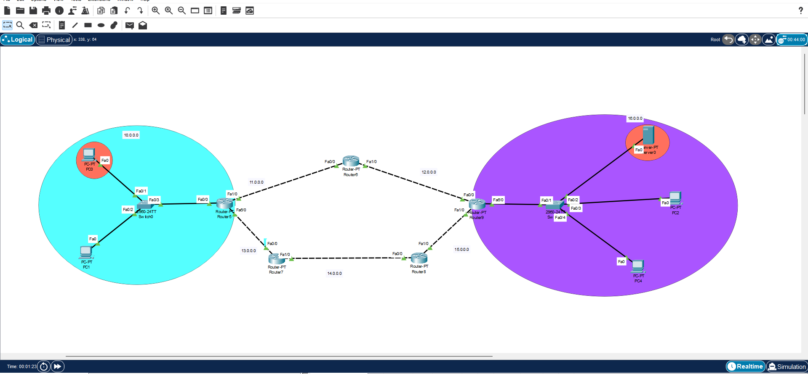

# 
# 🌐 Cisco Network Design & Simulation

This repository contains advanced network topologies 📐 designed and simulated using **Cisco Packet Tracer** 🛠️. The labs focus on building scalable, secure, and efficient enterprise network infrastructures 🧱.

---

## 🛠️ Key Technical Skills & Implementation:

| Feature | Description | Emojis |
| :--- | :--- | :---: |
| **VLAN Segmentation** | Organized network traffic to improve security and reduce broadcast domains 📉. | 🏷️ 🔒 |
| **Inter-VLAN Routing** | Configured Router-on-a-Stick 🍡 and Layer 3 switches for communication 📡. | 🛣️ ↔️ |
| **Routing Protocols** | Implementation of static and dynamic routing (OSPF/EIGRP) 🚀 for seamless data flow. | 🗺️ ⏩ |
| **Security & ACLs** | Applied Access Control Lists 🚫 to manage traffic and enhance network security 🛡️. | 🧱 🚫 |
| **DHCP & NAT** | Automated IP addressing 📝 and configured Network Address Translation for internet connectivity 🌐. | 📝 🌐 |

---

## 📊 Network Topology Previews:

### 1️⃣ Multi-Segment Enterprise Network 🏢
Detailed design featuring core and access layers with optimized routing between different zones 🚦.

### 2️⃣ Branch Connectivity & Infrastructure 🏙️
Simulation of connecting multiple branches with focus on redundancy and stable connectivity 🔄.

---

## 🎓 Learning Outcomes:
* ✅ Mastered Cisco Packet Tracer for network planning.
* ✅ Deepened understanding of network layered architecture.
* ✅ Practical experience in configuring Cisco routers and switches.

---

  <em>Developed as part of my continuous learning in Computer Networking.</em> 💡

